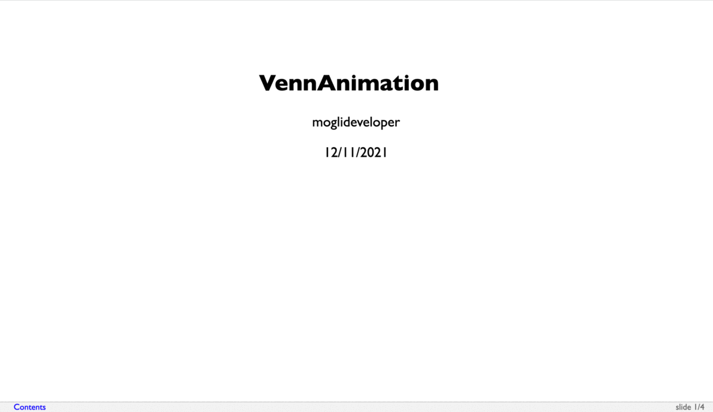
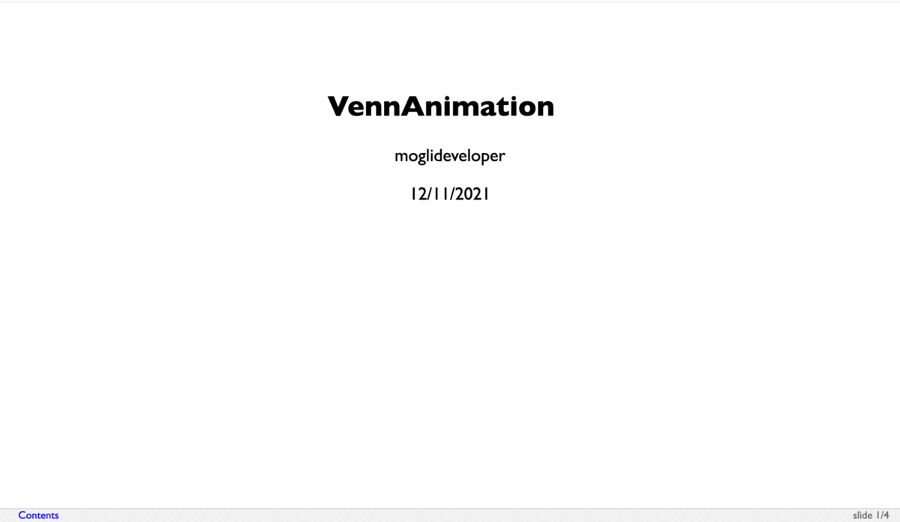
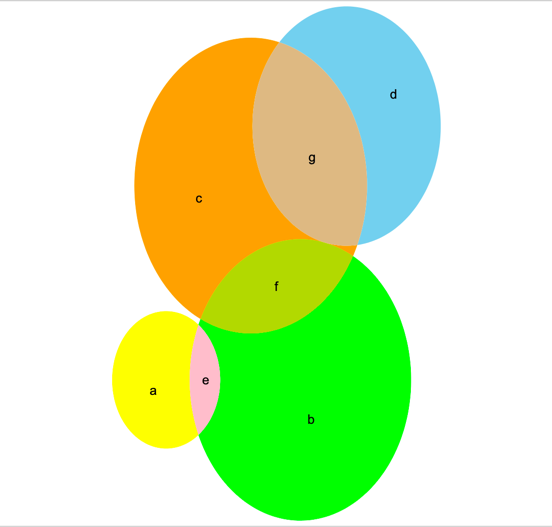
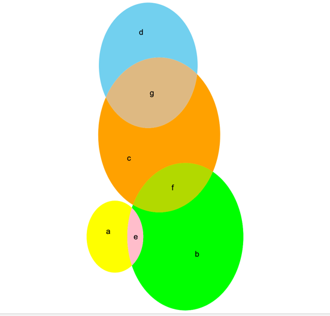
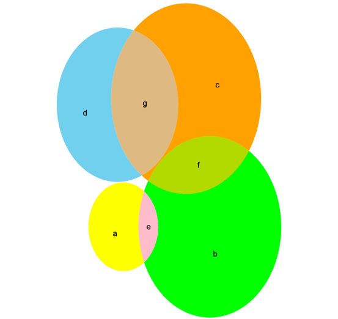

Context :   
Trying to create some venn diagram animation using R.

---

Attempt 1 (with two sets):   
Knit animation/with2Sets/animation.Rmd and open   
generated animation.html in browser.   
It gives a satisfactory animation (refer below)   
   

---

Attempt 2 (with four sets):   
Knit animation/with4Sets/animation.Rmd and open   
generated animation.html in browser.   
Animation is not satisfactory (refer below)   
   

Looks like every time diagram is generated for four sets, co-ordinates and    
radius of Venn diagram changes.   

---

To confirm, that co-ordinates and radius of Venn diagram   
changes on every run, try executing **executeThisFileMultipleTimes.R**   
multiple times and verify the generated diagram.   
Refer below sample generated diagrams :   

---

**Question:**   

How we can make sure, that co-ordinates and radius of Venn diagrams,   
doesn't changes on every draw ?

